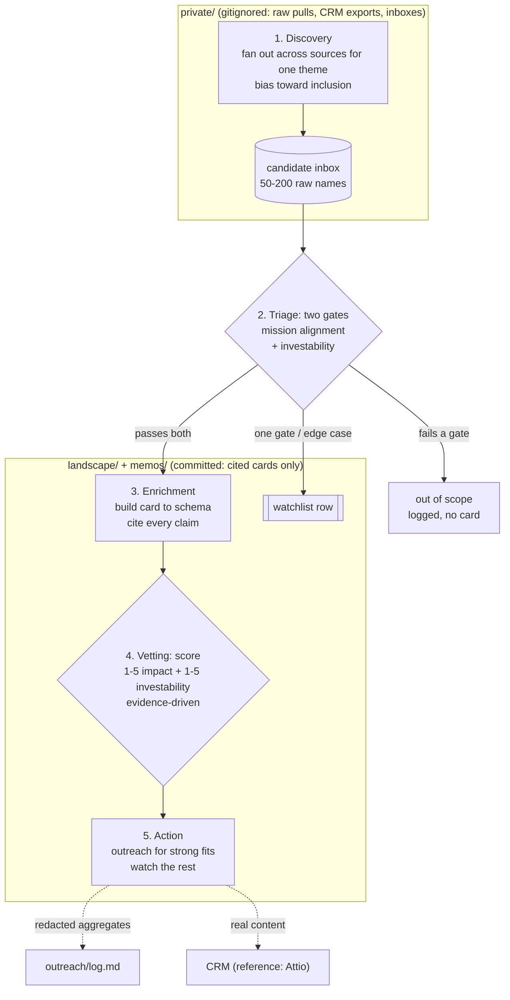

# AI x Global Health Radar

A git-native horizon-scanning workbench for AI in global health, driven by [Claude Code](https://claude.com/claude-code) and MCP connectors. Point it at a thesis and an AI agent maps the field into cited, scored, version-controlled briefs you can diff, audit, and share. Built for strategic foresight: reproducible, source-anchored landscape analysis instead of a black box.

[](https://github.com/abrarhaque-code/Global-Health-AI-Radar/actions/workflows/preflight.yml)


This instance is configured for **AI for global health in low- and middle-income countries (LMICs)**. The methodology and tooling are general: swap the thesis, taxonomy, and scoring to point it at any fast-moving field.

> **About the example content.** The company cards in `landscape/companies/` are anonymized composites: each is built from real diligence on several real companies, with identifying details altered and blended so it maps to no single company. Domain-level claims carry real citations; company-specific claims are marked as withheld. No real company is scored or rated. The trial and paper cards are real public objects with real registry identifiers. Replace all of it with your own when you adopt the template. See `docs/card_schema.md` for the composite convention.

## Why this exists

Scanning a fast-moving field usually lives in spreadsheets, a CRM, and someone's head. AI x Global Health Radar turns horizon scanning into a versioned, reviewable, citation-backed artifact:

- Every opportunity is a markdown card with a citation on every factual claim.
- Claude Code does the research across reference connectors (private-market data, PubMed, ClinicalTrials.gov, a CRM, web search).
- Raw provider data and CRM exports never enter git. Only synthesized, cited cards do.
- No database and no backend to run. The repo is the product.

## How it works

Every candidate runs through the same five-step loop (full walkthrough in `docs/workflow.md`). Discovery happens in the gitignored `private/` working area; only synthesized, cited cards are committed.



You run it. Claude Code with MCP connectors executes each step.

## What the output looks like

Every opportunity is one markdown file: YAML front-matter Claude Code can query, plus body sections where every factual claim carries a citation. A trimmed excerpt of a company card:

```yaml
---
slug: composite-tb-cxr
name: "Composite: AI chest-X-ray TB triage"
card_type: anonymized_composite
hq_country: "KEN"
impact_geographies: ["KEN", "ZMB", "NGA"]
ai_category: "health_data_diagnostics_genomics"
technical_archetype: "ai_native"
themes: ["theme_1"]
funding_stage: "series_b"
lmic_impact_score: 4
investability_score: 4
fit_rating: "likely_fit"
---
```

```markdown
## Where the impact lands

TB is the anchor because the burden is concentrated where the diagnostic
workforce is thinnest. WHO estimates 10.8 million people fell ill with TB in
2023 and 1.25 million died, the largest infectious-disease killer again that
year [web-001]. Documented deployment for this company is in Kenya, Zambia,
and Nigeria [co]. The claim is limited to those three named programs; no
"across Africa" language is used.
```

See the full card at [`landscape/companies/composite-tb-cxr.md`](landscape/companies/composite-tb-cxr.md), the browsable master table at [`landscape/INDEX.md`](landscape/INDEX.md), and a worked theme memo at [`memos/2026-07-16-theme-1-ai-tb-screening.md`](memos/2026-07-16-theme-1-ai-tb-screening.md).

## Status

[`landscape/INDEX.md`](landscape/INDEX.md) is the canonical dashboard: it is regenerated from card front-matter by `prompts/render_master_table.md`, so it never drifts from the cards. Snapshot of the shipped example content:

| Metric | Value |
|--------|-------|
| Full opportunity cards | 6 |
| Watchlist entries | 5 |
| Themes covered | 4 of 7 |
| By fit rating | 2 likely_fit, 2 adjacent, 2 monitor_only |
| Secondary track | 1 real trial, 1 real paper, 1 memo |
| Last regenerated | 2026-07-16 |

Regenerate after any card change: run `prompts/render_master_table.md`, which recomputes the snapshot, the distributions, and the master table.

## Quickstart

1. Clone this repo and open it in Claude Code (CLI, desktop, web, or an IDE extension).
2. Create the gitignored working directory the discovery prompts write to: `mkdir -p private`. Nothing under `private/` is ever committed (see [Privacy model](#privacy-model)).
3. Configure the MCP connectors you want (see [Connectors](#connectors)). PubMed, ClinicalTrials.gov, and web search are free; the private-market data provider and CRM are optional.
4. Point the radar at your thesis: rewrite `docs/thesis.example.md`, then align `taxonomy/themes.yaml` and `taxonomy/capital_partners.yaml` to match. To repoint to a different field end to end, follow [`docs/adapting.md`](docs/adapting.md).
5. Run your first discovery sweep: open `prompts/discover_by_theme.md` and follow it for one theme. It writes a candidate inbox to `private/_inbox-{date}-{theme}.md`.
6. Enrich a candidate into a card with `prompts/enrich_company.md`, then score it with `prompts/score_relevance.md`.
7. Regenerate the dashboard: run `prompts/render_master_table.md` to refresh `landscape/INDEX.md`.
8. Draft outreach for strong fits (`prompts/draft_outreach.md`) and sync with your CRM (`prompts/export_to_attio.md`).
9. Before sharing publicly, run `bash scripts/preflight.sh` and resolve any FAIL.

## Repository structure

```
Global-Health-AI-Radar/
├── README.md                 this file
├── CLAUDE.md                 project guide for Claude Code
├── LICENSE                   MIT
├── CONTRIBUTING.md           contributor guide
├── docs/
│   ├── thesis.example.md     example thesis the config operationalizes (replace this)
│   ├── methodology.md        scope, exclusions, two gates, scoring, source biases
│   ├── card_schema.md        opportunity card front-matter and body structure
│   ├── scoring_rubric.md     1-5 impact and investability rubrics
│   ├── workflow.md           the 5-step loop with worked examples
│   ├── adapting.md           worked example of repointing the radar to a new domain
│   ├── attio_mapping.md      card to CRM field mapping (reference: Attio)
│   ├── themes_overview.md    map of the example themes
│   ├── decisions.md          architecture decision records (ADR log)
│   └── known_limitations.md  method-level limitations and biases
├── prompts/                  15 reusable discovery, enrichment, scoring, outreach, sync prompts
├── taxonomy/                 example config: categories, themes, stages, partners, signals
├── landscape/
│   ├── companies/            opportunity cards (+ _watchlist.md)
│   ├── people/               founder and operator cards
│   ├── trials/               clinical trial cards (secondary track)
│   ├── papers/               research paper cards (secondary track)
│   └── INDEX.md              canonical dashboard, generated from card front-matter
├── memos/                    thematic deep-dives
├── outreach/
│   └── log.md                redacted aggregate counts only (real content lives in the CRM)
├── scripts/
│   └── preflight.sh          pre-push hygiene checks
└── .github/
    ├── workflows/preflight.yml   runs preflight on pull requests
    └── pull_request_template.md  PR checklist
```

## The two gates and scoring

A candidate earns a full card when it passes two gates at Triage:

1. **Mission alignment**: the thesis driver is real AND the company can deliver the impact the thesis cares about.
2. **Investability potential**: a real company, identifiable founders, an asset or trajectory.

Cards then get a 1-5 impact score and a 1-5 investability score, each defended with cited evidence, plus a `fit_rating` of `likely_fit`, `adjacent`, `monitor_only`, or `out_of_scope`. See `docs/scoring_rubric.md` and `docs/methodology.md`.

## Adapt it to your domain

The framework is domain-agnostic. To repoint it:

1. Rewrite `docs/thesis.example.md` as your thesis.
2. Edit `taxonomy/themes.yaml` (your themes), `taxonomy/capital_partners.yaml` (your relevant investors and partners), and the other taxonomy files.
3. Adjust the impact axis in `docs/scoring_rubric.md` to your impact definition (the investability axis is largely portable).
4. Swap connectors in the prompt tool sequences if you use different data sources or CRM.
5. Clear the example cards in `landscape/` and `memos/`, keep the schema.

For a full worked example that repoints the radar to AI for antimicrobial resistance surveillance and stewardship, see [`docs/adapting.md`](docs/adapting.md).

The global-health/LMIC example is one instantiation. The card schema, the two gates, the 5-step loop, and the CRM-sync pattern carry over to any thesis-driven sourcing problem.

## Connectors

Reference implementation, all pluggable:

| Role | Reference connector | Swap for |
|------|--------------------|----------|
| Private-market data | PitchBook | Crunchbase, Dealroom, manual entry |
| CRM | Attio | Airtable, Notion, HubSpot |
| Biomedical literature | PubMed | (public, free) |
| Clinical trials | ClinicalTrials.gov | (public, free) |
| Preprints | bioRxiv / medRxiv | (public, free) |
| Everything else | Web search | any web search MCP |

## Privacy model

The repo is built to be shared without leaking confidential data:

- `private/` is gitignored. Raw provider pulls, CRM exports, and discovery inboxes live there.
- The `*-private.md` filename pattern is also gitignored.
- Cards may carry opaque provider record IDs as private references; the underlying data is never committed.
- Outreach content lives in the CRM. Only aggregate, redacted counts go in `outreach/log.md`.
- `scripts/preflight.sh` scans for leaked tokens and writing-rule violations before a push. Add your own confidential tokens (firm names, portfolio companies, codenames) to `private/banned_tokens.txt` (gitignored), and run `bash scripts/preflight.sh --history` once before a first public push.

## Prompt library

| Request | Prompt |
|---------|--------|
| Build the universe for a theme | `prompts/discover_by_theme.md` |
| Enrich a known company | `prompts/enrich_company.md` |
| Score a card against the rubric | `prompts/score_relevance.md` |
| Draft outreach | `prompts/draft_outreach.md` |
| Push cards to the CRM | `prompts/export_to_attio.md` |
| Pull CRM updates back | `prompts/sync_from_attio.md` |
| Write a thematic memo | `prompts/thematic_memo.md` |
| Discover trials or papers | `prompts/discover_trials.md`, `prompts/discover_papers.md` |
| Enrich a person | `prompts/enrich_person.md` |
| Validate cards before export | `prompts/validate_attio_readiness.md` |
| Regenerate the master table | `prompts/render_master_table.md` |

## Contributing

Issues and pull requests are welcome. See `CONTRIBUTING.md`. Run `bash scripts/preflight.sh` before opening a PR.

## License

MIT. See `LICENSE`.
