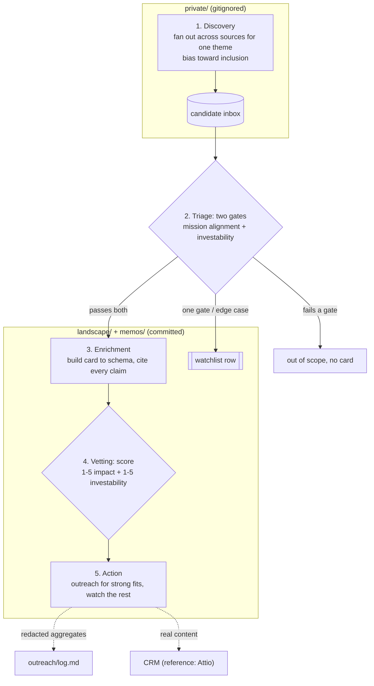

# Discovery-to-Action Workflow

The core operating loop for the workbench. Documents how a company moves from "name we saw" to "card with citations and a scored fit assessment" to "outreach drafted or watchlist entry." Apply this loop to every theme. The user runs it; an AI agent with MCP connectors executes the steps.

## First 30 minutes

If you are new to the workbench, do this once to feel the whole loop:

1. Read `docs/thesis.example.md` and `docs/methodology.md` (about 10 minutes).
2. Run `mkdir -p private`, then discover one theme with `prompts/discover_by_theme.md` (about 10 minutes).
3. Enrich one candidate with `prompts/enrich_company.md` and score it with `prompts/score_relevance.md` (about 10 minutes).

You now have one cited, scored card and a candidate inbox. Regenerate `landscape/INDEX.md` with `prompts/render_master_table.md`, then run `bash scripts/preflight.sh` before you share.

## The 5-step loop



Plain-text version of the same loop, for readers without a Mermaid renderer:

```
[1. Discovery: cast wide]
       |
[2. Triage: relevance gates]
       |
[3. Enrichment: build card]
       |
[4. Vetting: evidence-driven scoring]
       |
[5. Action: outreach or watch]
```

**Operating principle:** bias toward false positives at Discovery; filter at Triage and Vetting. The two real gates are mission alignment and investability potential, applied at Triage. The positive-signals list (revenue, WHO PQ, foundation inclusion, etc.) are confidence builders at Vetting, not gates.

---

## Step 1: Discovery (cast wide)

For a given theme, fan out across all these sources:

| Source | MCP tool | What you pull |
|--------|----------|---------------|
| A private-market data provider (reference: PitchBook; swap for Crunchbase, Dealroom, or manual entry) | `pitchbook_search`, `pitchbook_get_profile` | Sector + geography + stage matches in priority countries |
| Foundation grant DBs | Web search | Grantee announcements from the major global health funders |
| PubMed | `search_articles` | AI + disease + LMIC author affiliations; author affiliations surface their companies |
| ClinicalTrials.gov | `search_trials`, `search_by_sponsor` | Trials with AI components and LMIC sites; sponsor names |
| News and press | Web search | Funding announcements, partnerships, regulatory approvals in priority markets |
| Conference rosters | Web search | Regional health-tech summit speakers and exhibitors |
| Thesis references | Read | The thesis anchors and the adjacency/watchlist in `docs/thesis.example.md` |
| A CRM (reference: Attio; swap for Airtable, Notion, HubSpot) | `search-records` | Companies already in the fund's pipeline |
| Cross-references | (Iterative) | Peers, competitors, co-investors mentioned while enriching other cards |

**Output:** a raw list of 50-200 candidate names per theme, stored in `private/_inbox-{YYYY-MM-DD}-{theme}.md` (gitignored). Each entry has name, source(s), one-line description, and source URL or record ID.

---

## Step 2: Triage (relevance check)

For each candidate, a 5-10 minute pass. Check four things:

1. **Mission alignment** (gate 1): AI is a meaningful product driver AND the company is positioned to drive LMIC global health impact
2. **Investability potential** (gate 2): real company exists, identifiable founders, some asset or trajectory
3. **Not on the exclusions list**: foundation-model lab, API wrapper, HIC-only, surveillance, consumer wellness, D2C-only telehealth, drug discovery without proprietary biology
4. **Not a duplicate** of an existing card

Bucket each candidate:

- **Real opportunity** → enrich fully (Step 3)
- **Adjacent** (mission-aligned but stage or scope edge case) → lighter enrichment, watchlist tag
- **Monitor only** → one-line entry in `landscape/companies/_watchlist.md`
- **Out of scope** → log reason in the inbox file; no card

**Bias toward inclusion.** If you can't immediately rule a company out, enrich it. False positives at Triage are filtered at Vetting; false negatives at Triage are permanently lost.

The positive-signals list (WHO PQ, NMRA approval, foundation initiative inclusion, recurring revenue, anchor public-system customer) does **not** decide entry at this stage. It informs scoring later.

---

## Step 3: Enrichment (build the card)

For each candidate in the Real opportunity or Adjacent bucket, use `prompts/enrich_company.md`.

Tool sequence:

1. **Private-market data provider**: `pitchbook_get_profile`, `pitchbook_get_company_deals`, `pitchbook_get_team_members`, `pitchbook_get_company_investors`. Raw content stays in `private/`; only opaque record IDs go into committed front-matter.
2. **Web search**: company website, last 18-24 months of news, partnerships, founder backgrounds, regional press
3. **PubMed**: `search_articles` by company name, founders, clinical advisors; pull validation studies
4. **ClinicalTrials.gov**: `search_by_sponsor` for any trials the company has sponsored
5. **CRM**: `search-records` for prior relationships in the fund's pipeline

**Output:** a markdown file at `landscape/companies/{slug}.md` matching `docs/card_schema.md`. Required: complete YAML front-matter, all body sections, citations on every factual claim, `[uncertain]` markers where data is thin.

---

## Step 4: Vetting (evidence-driven scoring)

For each enriched card, apply `prompts/score_relevance.md`.

- **LMIC impact score (1-5)**: walk through the rubric in `docs/scoring_rubric.md`; each level requires evidence cited in the card
- **Investability score (1-5)**: same; evidence-based
- **Fit rating**: Likely fit / Adjacent / Monitor only / Out of scope

**Sparse evidence does not auto-lower the score.** A pre-revenue biotech in TB with strong scientific founders and an NIH-funded preclinical asset can score 4 on investability if the evidence supports that level. The rubric requires evidence; it does not require a long card.

The positive-signals list acts as confidence builders and tiebreakers here. A company with a Series A led by a global health foundation and WHO PQ in progress is a stronger signal than one without those markers, even at similar headline metrics.

---

## Step 5: Action (outreach or watch)

Based on the combined treatment table in `docs/scoring_rubric.md`:

- **Likely fit + strong scores (4+ on both)** → priority outreach cohort. Use `prompts/draft_outreach.md`.
- **Likely fit + moderate scores (3-4)** → outreach with light diligence first
- **Adjacent + middling scores** → monitor, light-touch outreach when warm path appears
- **Monitor only** → 90-day refresh on the card
- **Out of scope** → archive with reason

Track all outreach in the CRM (real content) and `outreach/log.md` (redacted aggregates).

---

## Worked example: ExampleDx (fictional)

An illustrative walkthrough on a fictional company. ExampleDx is a Kenya-based AI chest-X-ray TB-screening company, named in the thesis anchors as a Theme 1 pipeline anchor. CEO: Jane Okafor. Use it as a pattern, not a real target.

### Step 1: Discovery, where ExampleDx surfaces

- Thesis anchors (direct reference)
- Private-market data provider search: "computer vision" + "Kenya" + "healthcare" returns ExampleDx
- PubMed: founder publications on AI TB screening in LMIC settings
- Possibly news search: "Kenya AI tuberculosis screening funding"

### Step 2: Triage

- Mission alignment: AI-native chest-X-ray TB screening, Kenya focus -> yes
- Investability potential: real company, identifiable founders, demonstrated product -> yes
- Not on exclusion list: confirmed
- Not a duplicate: confirmed

Result: **Real opportunity -> enrich**.

### Step 3: Enrichment

Pull:
- Private-market data provider: stage, funding rounds, investors, team (data in `private/` only)
- Website: product description, deployment list (Kenya county networks), founder bios
- PubMed: any validation studies; search "ExampleDx" or founder names; look for chest X-ray + Kenya + TB + AI papers
- ClinicalTrials.gov: any registered trials by ExampleDx as sponsor
- CRM: any prior contact in the fund's pipeline

Build the card following `docs/card_schema.md`, with citations on every claim. For a finished card of this type, see `landscape/companies/composite-tb-cxr.md`.

### Step 4: Vetting

- LMIC impact: probably 3-4 (Kenya deployments are real but scale to be verified)
- Investability: probably 3-4 (early stage, team strength to assess)
- Fit rating: Likely fit (named in the thesis anchors)

### Step 5: Action

Score is favorable. Draft outreach using `prompts/draft_outreach.md`:
- Anchors: specific Kenya deployment, founder background (Jane Okafor), recent publications
- Warm-path check: mutual connections via co-investors in the fund's network
- Email drafted; user reviews, sends, tracks in the CRM

---

## Worked example: GenomeAfrica (fictional)

A second illustrative walkthrough on a fictional company. GenomeAfrica is a Ghana-based population-genomics and health-data platform, named in the thesis anchors as a Theme 2 pipeline anchor. Treat it as a pattern, not a real target.

### Step 1: Discovery, where GenomeAfrica surfaces

- Thesis anchors and Theme 2 of the thesis (direct anchor)
- News: a partnership with a major pharma partner for a regional cancer-genomics atlas
- News: a high-throughput sequencing install (first of its kind in-country)
- Private-market data provider: Ghana healthcare sector tag

### Step 2: Triage

- Mission alignment: AI/genomics applied to African patient populations -> yes
- Investability potential: real lab, named pharma partnership, capital raised -> yes
- Not on exclusion list: confirmed
- Not a duplicate: confirmed

Result: **Real opportunity -> enrich**.

### Step 3: Enrichment

Pull:
- Private-market data provider: full GenomeAfrica profile, deal history, team, investors
- Website: lab capacity, sample throughput, customer list, founder background
- PubMed: GenomeAfrica-affiliated publications, African genome papers, founder publications
- News: pharma partnership terms, sequencing-install context, any new funding signals
- CRM: any prior contact with the GenomeAfrica team

Build the card following `docs/card_schema.md`, with:
- Citations to the pharma partnership announcement and the sequencing-install news
- A sector risk note in the "Open questions and risks" section: capital-intensive genomics platforms have a track record of slow commercial conversion
- Specific commercial revenue conversion as an open question

For a finished card of this type, see `landscape/companies/composite-genomics-registry.md`.

### Step 4: Vetting

- LMIC impact: probably 4 (multi-country potential, real Ghana operations, pharma partnership documented)
- Investability: probably 4 (Series A range, demonstrable lab capacity, named co-investor signals)
- Fit rating: Likely fit (named anchor; Theme 2 lean-in)
- Confidence builders: the pharma partnership (a positive signal), capital partner cohort

### Step 5: Action

Score is favorable. Outreach: warm-path check via the pharma partner or co-investors in the fund's network. Draft email anchored on the pharma partnership and the sequencing install (concrete, recent, verifiable). User reviews, sends, tracks.

---

## Common failure modes (and how to catch them)

- **Step 2 false negatives**: a real company gets rejected too early because the description sounded vague. Antidote: when in doubt, enrich.
- **Step 3 LLM overclaiming**: the model invents traction metrics not in sources. Antidote: spot-check 1 in 5 cards against cited sources during weekly review.
- **Step 4 score padding**: a company scores high because the reviewer likes the founder. Antidote: rubric walk-through requires citing specific evidence in the card.
- **Step 5 outreach burnout**: too many emails too fast; response rate degrades. Antidote: cap at 15-20 per week; track response rate.

## When to deviate

- **Skip Step 1** when you have a specific company name from outside the system (warm intro, news article, peer-fund tip). Start at Step 2 or 3.
- **Skip Step 4** for the adjacency/watchlist. These companies are "monitor only" by definition; lightweight cards are sufficient.
- **Loop back** to Step 1 if Step 4 reveals only 1-2 strong cards in a theme; expand discovery.

## Cadence

- **Theme discovery**: one to two themes per week during the build-out phase
- **Weekly signal scan**: run `taxonomy/signal_triggers.yaml` events across active cards
- **Monthly refresh**: cards with `last_updated` older than 60 days get re-pulled
- **Quarterly review**: full landscape audit for theme balance, taxonomy drift, scoring drift
